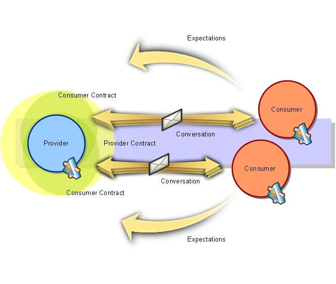

<!-- $size: 16:9 -->

4장 스프링 부트 테스트
===

2018-07-13, 최범균(madvirus@madvirus.net)

---
<!-- page_number: true -->

* 부트 통합 테스트
* @MockBean
* 테스트 슬라이스
* 전구간 테스트
* 컨슈머 주도 계약 테스트

---
# 부트 통합 테스트(JUnit 4)

* spring-boot-starter-test 모듈 사용
* SpringRunner: 스프링 통합 테스트를 위한 JUnit 러너
* @SpringBootTest: 테스트를 위한 컨텍스트 로딩 지원
```
@RunWith(SpringRunner.class)
@SpringBootTest
public class AccountServiceApplicationTests {
    @Autowired
    private ApplicationContext ctx;

    @Test
    public void contextLoads() {
        assertThat(ctx).isNotNull();
    }
}
```

---
# 부트 통합 테스트(JUnit 5)

* spring-boot-starter-test 모듈 사용
* SpringRunner: 스프링 통합 테스트를 위한 JUnit 러너
* @SpringBootTest: 테스트를 위한 컨텍스트 로딩 지원
```
@ExtendWith(SpringExtension.class)
@SpringBootTest
public class AccountServiceApplicationTests {
    @Autowired
    private ApplicationContext ctx;

    @Test
    public void contextLoads() {
        assertThat(ctx).isNotNull();
    }
}
```

* http://javacan.tistory.com/490

---
# 모의 객체 생성 지원

* SpringRunner + @MockBean

<div style="font-size: 16pt">

```java
@RunWith(SpringRunner.class)
public class AccountServiceTest {
    @MockBean
    private UserService userService; // Mockito 모의 객체
    @MockBean
    private AccountRepository accountRepository;

    private AccountService accountService;

    @Before
    public void before() {
        accountService = new AccountService(accountRepository, userService);
    }

    @Test
    public void getUserAccountsReturnsSingleAccount() {
        given(accountRepository.findAccountsByUsername("user"))
                .willReturn(Collections.singletonList(new Account("user", "123456789")));

        given(userService.getAuthenticatedUser()).willReturn(new User(0L, "user", "first", "last"));

        List<Account> actual = accountService.getUserAccounts();
        assertThat(actual).hasSize(1);
    }
}
```

</div>

---
# 테스트 서블릿 컨테이너 설정

* @SpringBootTest의 webEnvironment 속성

<div style="font-size: 18pt">

옵션 | 설명 | 컨텍스트
--- | --- | ---
MOCK | 모의 서블릿 환경 제공 (기본) | WebApplicationContext
DEFINED_PORT | 지정한 포트 번호를 통해 실제 서블릿 환경 제공 | EmbeddedWebApplicationContext
RANDOM_PORT | 임의 포트 번호를 통해 실제 서블릿 환경 제공 | EmbeddedWebApplicationContext
NONE | 서블릿 환경 제공하지 않음 | SpringApplication으로 컨텍스트 로딩

</div>

---
# 테스트 서블릿 컨테이너 설정 예: RANDOM_port

<div style="font-size: 16pt">

```java
@RunWith(SpringRunner.class)
@SpringBootTest(webEnvironment = SpringBootTest.WebEnvironment.RANDOM_PORT)
public class WebRandomPortTest {
    private Logger logger = LoggerFactory.getLogger(getClass());

    @LocalServerPort
    private int port;

    @Autowired
    private TestRestTemplate restTemplate;

    @Test
    public void accountsApi() throws InterruptedException {
        ParameterizedTypeReference<List<Account>> type = new ParameterizedTypeReference<List<Account>>() {};
        ResponseEntity<List<Account>> resp = restTemplate.exchange("/fake/accounts", HttpMethod.GET, null, type);
        assertThat(resp.getBody()).hasSize(1);
    }

}
```

</div>

---
# @JsonTest, JacksonTester: JSON 테스트

```java
@RunWith(SpringRunner.class)
@JsonTest
public class JsonSliceTest {
    @Autowired
    private JacksonTester<Account> json;

    @Test
    public void serialize() throws IOException {
        JsonContent<Account> write = json.write(new Account(1L, "이름", "계좌번호"));
        assertThat(write).hasJsonPathStringValue("$.username", "이름");
    }
}
```

```
public class JsonSliceTest {
    private JacksonTester<Account> json;

    @Before
    public void setup() {
        ObjectMapper objectMapper = new ObjectMapper();
        JacksonTester.initFields(this, objectMapper);
    }
```

---
# @WebMvcTest: 단일 컨트롤러 테스트

```java
@RunWith(SpringRunner.class)
@WebMvcTest(AccountController.class)
public class WebMvcSliceTest {
    @Autowired
    private MockMvc mvc;

    @MockBean
    private AccountService service; // AccountController의 @Autowired 대상 mocking

    @Test
    public void name() throws Exception {
        given(service.getUserAccounts())
            .willReturn(Arrays.asList(new Account(1L, "이름", "계좌")));

        mvc.perform(get("/fake/accounts"))
                .andDo(print())
                .andExpect(status().isOk())
                .andExpect(jsonPath("$[0].username").value("이름"));

    }
}
```

---
# @DataJpaTest

```java
@RunWith(SpringRunner.class)
@DataJpaTest
public class DataJpaSliceTest {
    @Autowired
    private TestEntityManager entityManager;
    @Autowired
    private AccountRepository accountRepository;

    @Test
    public void findOne() {
        Account entity = new Account("username", "account");
        entityManager.persist(entity);

        Account sel = accountRepository.findById(entity.getId());
        assertThat(sel).isNotNull();
    }
}
```

---
# @RestClientTest

<div style="font-size: 16pt">

```java
@RunWith(SpringRunner.class)
@RestClientTest( {UserService.class} ) // UserService 테스트 대상
@AutoConfigureWebClient(registerRestTemplate=true)
public class RestClientSliceTest {
    @Value("${user-service.host:user-service}")
    private String serviceHost;

    @Autowired
    private UserService userService;

    @Autowired
    private MockRestServiceServer server;

    @Test
    public void getAuthenticatedUser() {
        String jsonBody = "{\"id\": 1, \"username\": \"name\", \"firstName\": \"first\", \"lastName\": \"last\"}";
        server.expect(requestTo("http://" + serviceHost + "/uaa/v1/me"))
                .andRespond(withSuccess(jsonBody, MediaType.APPLICATION_JSON));
        User user = userService.getAuthenticatedUser();
        assertThat(user.getId()).isEqualTo(1L);
        assertThat(user.getUsername()).isEqualTo("name");
    }
}
```

* @AutoConfigureWebClient: 테스트 대상이 RestTemplateBuilder를 사용하지 않을 때 테스트를 위한 RestTemplate을 주입

</div>

---
# 마이크로서비스와 전 구간 테스트

* 비즈니스 기능 검증에 초점, 사용자 관점에서 기능 테스트
* 분리된 마이크로서비스에 상태를 분산 저장하는 클라우드 네이티브 어플리케이션을 테스트할 때는 데이터 일관성을 점검할 수 있는 전 구간 테스트 설계 이해 필수
  * 결과적 일관성(Eventual Consistency) 사용
* 어플리케이션 간 통합을 어떤 방법으로 테스트할 것인가?
  * 제대로 수행하려면 운영 환경과 동일한 구성으로 테스트해야 함
  * 하나의 마이크로서비스를 통합 테스트하기 위해 이런 환경을 구축하는 것은 많은 시간/비용 필요
* 컨슈 주도 계약 테스트: 마이크로서비스 의존관계를 필요로 하는 통합 테스트를 가능한 빨리 실행하고 결과를 빨리 확인할 수 있도록 하기 위한 방법

---
# 컨슈머 주도 계약 테스트

<div style="float: left; width: 45%">

* 공개된 계약을 사용해서 컨슈머와 프로듀서 사이의 예상 동작을 유지하고 판정하는 방식
* 전형적인 흐름
  * 컨슈머가 계약 작성
  * 프로듀서가 계약을 지원하는 스텁 제공
  * 컨슈머는 스텁을 이용해서 모의 프로듀서를 만들어 통합 테스트

</div>

<div style="float: left; width: 55%">



</div>

---
# 스프링 클라우드 컨트랙트

* Spring Cloud Contract Verifier CDL(Contract Definition Language) 제공
* 이 언어를 사용해서 프로듀서용 테스트 코드와 클라이언트용 스텁 생성

---
# 프로듀서와 컨슈머가 할 일

<div style="float: left; width: 20%">

공통
* CDL 작성

</div>

<div style="float: left; width: 40%">

프로듀서:
* 의존 설정
* CDL로부터 테스트 코드 생성에 사용할 기반 클래스 작성
* 스텁 생성 및 리포지토리 등록

</div>

<div style="float: left; width: 40%">

컨슈머:
* 의존 설정
* 스텁 이용한 통합 테스트 작성

</div>

---
# CDL 작성 예

<div style="font-size: 14pt">

```groovy
package contacts

org.springframework.cloud.contract.spec.Contract.make {
    request {
        method 'GET'
        url '/uaa/v1/me'
        headers {
            header('Content-Type': consumer(regex('application/json.*')))
        }
    }
    response {
        status 200
        body([
            username : value(producer(regex('[A-Za-z0-9]+'))),
            firstName : value(producer(regex('[A-Za-z]+'))),
            lastName : value(producer(regex('[A-Za-z]+'))),
            id : value(producer(regex('[0-9]+')))
        ])
        headers {
            header('Content-Type': value(
                    producer('application/json;charset=UTF-8'),
                    consumer('application/json;charset=UTF-8'))
            )
        }
    }
}
```

</div>

---
# 프로듀서: 의존 설정

<div style="font-size: 14pt">

```xml
<dependencyManagement>
    <dependencies>
        <dependency>
            <groupId>org.springframework.cloud</groupId>
            <artifactId>spring-cloud-contract-dependencies</artifactId>
            <version>2.0.0.RELEASE</version>
            <type>pom</type>
            <scope>import</scope>
        </dependency>
    </dependencies>
</dependencyManagement>
```

```xml
<dependency>
    <groupId>org.springframework.cloud</groupId>
    <artifactId>spring-cloud-starter-contract-verifier</artifactId>
    <scope>test</scope>
</dependency>        
```

```xml
<plugin>
    <groupId>org.springframework.cloud</groupId>
    <artifactId>spring-cloud-contract-maven-plugin</artifactId>
    <version>2.0.0.RELEASE</version>
    <extensions>true</extensions>
    <configuration>
        <baseClassForTests>demo.UserServiceBase</baseClassForTests>
    </configuration>
</plugin>
```

</div>

---
# 프로듀서: 테스트 코드 생성 위한 기반 클래스

<div>

```java
public class UserServiceBase {

    @Before
    public void setUp() {
        RestAssuredMockMvc.standaloneSetup(new UserController(...));
    }
}

```

</div>


---
# 프로듀서 테스트 코드 및 스텁 생성

<div style="float: left; font-size: 18pt; width: 45%">

```
# CDL에서 프로듀서용 테스트 코드 생성
mvnw spring-cloud-contract:generateTests

# CDL에서 WireMock용 스텁 매핑 생성
mvnw spring-cloud-contract:convert

# WireMock용 스텁 매핑 파일에서 스텁용 jar 생성
mvnw spring-cloud-contract:generateStubs

# 전 과정 실행
mvnw clean package

# 로컬 리포지토리까지 등록
mvnw clean install
```

</div>

<div style="float: left; width: 55%">

* target
  * 아티팩트-버전.jar
  * 아티팩트-버전-stubs.jar
  * generated-test-sources: 프로듀서용 테스트 코드
  * stubs: WireMock 스텁 매핑 파일

</div>

---
# 컨슈머: 의존 설정

```xml
<dependency>
    <groupId>org.springframework.cloud</groupId>
    <artifactId>spring-cloud-starter-contract-stub-runner</artifactId>
    <scope>test</scope>
</dependency>
```

---
# 컨슈머: 스텁 이용 테스트 @AutoConfigureStubRunner

* WireMock 이용해서 로컬 스텁 서버 생성

<div style="font-size: 16pt">

```java
@RunWith(SpringRunner.class)
@SpringBootTest(webEnvironment = SpringBootTest.WebEnvironment.NONE)
@TestPropertySource(properties = "user-service.host=localhost")
@AutoConfigureStubRunner(ids = {"user-service:user-service:+:stubs:8888"}, 
                         stubsMode = StubRunnerProperties.StubsMode.LOCAL)
public class ConsumerDrivenTest {
    @Autowired
    private UserService userService;

    @Test
    public void getAuthenticatedUser() {
        User user = userService.getAuthenticatedUser();
        assertThat(user.getUsername()).matches("[A-Za-z0-9]+");
    }
}
```

```java
public class UserService {
    ...
    public User getAuthenticatedUser() {
        URI uri = URI.create(String.format("http://%s:8888/uaa/v1/me", serviceHost));
        RequestEntity<Void> request = 
                RequestEntity.get(uri).header(HttpHeaders.CONTENT_TYPE, MediaType.APPLICATION_JSON_VALUE).build();
        return restTemplate.exchange(request, User.class).getBody();
    }
```
