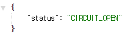

<!-- $size: 16:9 -->

12장 데이터 통합
===
신림프로그래머 최범균 2018-08-21

(스프링 클라우드 데이터 플로우 제외)

---
<!-- page_number: true -->

* 장애 격리와 단계적 성능 저하: 재시도, 서킷브레이커
  * 재시도
  * 서킷브레이커
* CQRS + Axon

---
# 데이터 통합

* 어려운 점: 여러 노드 간 통신, 분산 상태 관리
* CAP 정리(CAP Theorem)
  * 네트워크로 공유된 데이터 시스템은 네트워크 장애시 C와 A 중 하나만 가능
    * 일관성(Consistency) : 모든 노드가 동일한 최신의 쓰기에 성공한 데이터를 리턴
    * 가용성(Availability) : (장애가 아닌) 모든 노드는 읽기/쓰기 요청에 응답
    * 분리 허용(Partition Tolerant) : 노드 간 통신에 문제가 생겨도 시스템이 정상적으로 동작
* 정상 상황을 고려한 PACELC
  * P(분리) 상황에서 A(가용성)와 C(일관성)
  * E(else, 정상) 상황에서 L(지연 시간)과 C(일관성)

---
# 분산 트랜잭션

* X/Open XA : 전통적인 분산 트랜잭션 관리 방법
  * 2단계 커밋(2-Phase Commit)
* 단점
  * 코디네이터가 SPOF
  * 성능(노드 간 많은 통신)
  * 최근의 REST API 환경에 맞지 않음

---
# 장애 격리와 단계적 성능 저하

* 재시도 : 요청이나 잠재적으로 불안정한 단일 작업은 (일정 횟수만큼) 재시도
* 서킷브레이커 : 이전 요청 성공 여부에 따라 요청 유입을 차단

---
# 재시도: 스프링 리트라이


<div style="float: left; width: 60%; font-size: 19pt">

```java
@Component
public class RetryableGreetingClient {
  private final RestTemplate restTemplate;
  private final String serviceUri;

  ...
    
  @Retryable(maxAttempts = 4, 
      backoff = @Backoff(value = 2000L, multiplier = 2))
  public String greet(String name) {
    logger.info("attemp: call the greeting-service");

    return restTemplate.exchange(
                serviceUri + "/hi/" + name, 
                HttpMethod.GET, null, ptr, name)
            .getBody()
            .get("greeting");
    ...
  }
}
```

</div>

<div style="float: left; width: 40%; font-size: 18pt">

* @EnableRetry 애노테이션
  * 재시도 기능 활성화
* @Retryable 애노테이션
  * 재시도 실행 대상 메서드 지정
  * maxAttemps : 재시도 횟수
  * backoff : 재시도 주기
  * include : 재시도 적용 대상 익셉션
  * exclude : 재시도 예외 대상 익셉션

</div>


<div style="clear: both"></div>

---
# 서킷브레이커: Hystrix


---
# 스프링 클라우드 Hystrix 적용

* org.springframework.cloud:spring-cloud-starter-netflix-hystrix 모듈
* @EnableCircuitBreaker : 활성화, @HystrixCommand : 서킷 브레이커 적용

<div style="font-size: 16pt">

```java
@Component
public class CBGreetingClient {
    ...
    @HystrixCommand(commandProperties = {
            @HystrixProperty(name = "metrics.rollingStats.timeInMilliseconds", value="10000"), // 10초 동안
            @HystrixProperty(name = "circuitBreaker.requestVolumeThreshold", value="6"), // 6개 이상 요청
            @HystrixProperty(name = "circuitBreaker.errorThresholdPercentage", value="30"), // 30% 이상 실패
            @HystrixProperty(name = "circuitBreaker.sleepWindowInMilliseconds", value="20000"), // 20초 동안 서킷 오픈
    })
    public String greet1(String name) {
        logger.info("HYSTRIX01 : call the greeting-service-ch12");

        ParameterizedTypeReference<Map<String, String>> ptr =
                new ParameterizedTypeReference<Map<String, String>>() {};

        return restTemplate.exchange(serviceUri + "/hi/" + name, HttpMethod.GET, null, ptr, name)
                .getBody().get("greeting");
    }
```

</div>

---
# 서킷 브레이커 주요 설정

설정 프로퍼티: https://github.com/Netflix/Hystrix/wiki/Configuration

---
# 스프링부트 연동 서킷 브레이커 메트릭

<div style="font-size: 16pt; float: left;">

* 메트릭
  * localhost:8080/actuator/metrics/hystrix.circuit.breaker.open
  * localhost:8080/actuator/metrics/hystrix.circuit.breaker.open?tag=key:greet1
* 메트릭 스트림
  * localhost:8080/actuator/hystrix.stream
</div>


---
# 스프링부트 연동 서킷 브레이커 헬스

<div style="font-size: 16pt">

```
# application.properties: CIRCUIT_OPEN 상태 추가
management.health.status.order=FATAL, DOWN, OUT_OF_SERVICE, CIRCUIT_OPEN, UNKNOWN, UP
# management.endpoint.health.show-details=always
```

* URL: localhost:8080/actuator/health

</div>

<div style="float:left; width: 400px">



</div>

<div>


</div>

---
# 스프링부트 연동 히스트릭스 대시보드

* org.springframework.cloud:spring-cloud-starter-netflix-hystrix-dashboard 모듈
* @EnableHystrixDashboard : 활성화
* 대시보드: http://localhost:8080/hystrix
  * 히스트릭스 스트림 주소 입력(예: http://localhost:8080/actuator/hystrix.stream)


---
# 사가(SAGA)

<div style="font-size: 18pt">

* 사가는 연속된 서브 트랜잭션으로 구성된 오래 지속되는 트랜잭션
* 각 트랜잭션은 보상 트랜잭션을 정의해서 트랜잭션의 효과를 취소해서 시스템을 의미적으로 일관된 상태로 되돌릴 수 있어야 함
* 가용성 > 일관성
  * 사가의 전체 작업이 완료도기 전에 각 서브 트랜잭션의 처리 결과가 나머지 시스템에서 보일 수 있음
* 사가 실행 코디네이터(SEC, Saga Execution Coordinator)
  * 실행 중인 트랜잭션과 레코드의 영속성 진행 정도를 추적
  * 사가 트랜잭션이 실패하면 SEC는 보상 트랜잭션을 실행
* 트랜잭션
  * 사가 트랜잭션 : 최대 한 번(at most once), 보상 트랜잭션 : 최소 한 번(at least once)
  * 멱등성(idempotent) 보장 필요

</div>

---
# CQRS(Command Query Responsibility Segregation)


---
# 이벤트 소싱


---
# 이벤트 소싱과 현재 상태


---
# Axon

* CQRS를 위한 프레임워크
  * 커맨드 + 커맨드 핸들러를 이용한 요청 처리
  * 이벤트 처리지원
  * 분산 이벤트 처리 지원: AMQP+RabbitMQ, kafka(안정화 필요)
* 이벤트 소싱 리포지토리 지원

---
# Axon + 부트 설정

<div style="font-size: 18pt; float: left">

* 의존 설정

```xml
<dependency>
    <groupId>org.axonframework</groupId>
    <artifactId>axon-spring-boot-starter</artifactId>
    <version>3.3</version>
</dependency>

<dependency>
    <groupId>org.springframework.boot</groupId>
    <artifactId>spring-boot-starter-data-jpa</artifactId>
</dependency>

<dependency>
    <groupId>org.axonframework</groupId>
    <artifactId>axon-amqp</artifactId>
    <version>3.3</version>
</dependency>

<dependency>
    <groupId>org.springframework.boot</groupId>
    <artifactId>spring-boot-starter-amqp</artifactId>
</dependency>
```

</div>

<div style="font-size: 18pt; float: left; margin-left: 10px">

* 자동 설정
  * 커맨드 버스
  * JPA 기반 이벤트 소싱 리포지토리
  * 이벤트 버스
  * AMQP 연동

</div>

---
# Axon + 부트 설정: AMQP 관련 설정

<div style="font-size: 18pt; float: left">

* Axon AMQP 연동

```
# application.properties
axon.amqp.exchange=complaints
```

</div>

<div style="font-size: 18pt; float: left; margin-left: 10px">

* AMQP 설정

```
@Configuration
public class AmqpConfiguration {
    @Bean
    Exchange exchange() {
        return ExchangeBuilder.fanoutExchange("complaints").build();
    }
    @Bean
    Queue queue() {
        return QueueBuilder.durable("complaints").build();
    }
    @Bean
    Binding binding() {
        return BindingBuilder
                .bind(queue()).to(exchange())
                .with("*").noargs();
    }
    @Autowired
    public void configure(AmqpAdmin admin) {
        admin.declareExchange(exchange());
        admin.declareQueue(queue());
        admin.declareBinding(binding());
    }
}
```

</div>

---
# 커맨드, 커맨드 핸들러 예제 코드

<div style="font-size: 16pt; float: left">

* 커맨드

```java
public class AddCommentCommand {
    @TargetAggregateIdentifier
    private String complaintId;
    private String commentId;
    ...
    private Date when;
    // 생성자, getter/setter 등
```

* 커맨드 게이트웨이
```java
private CommandGateway cg;
...
AddCommentCommand command =
  new AddCommentCommand(
      complaintId, ...);

return cg.send(command)
     // CompletableFuture
     .thenApply(commentId -> {
        ...
     });
```
</div>

<div style="font-size: 16pt; float: left; margin-left: 10px">

* 커맨드 핸들러

```java
@Aggregate
public class ComplaintAggregate {
    @AggregateIdentifier
    private String complaintId;
    private boolean closed;
    ...
    @CommandHandler
    public ComplaintAggregate(FileComplaintCommand c) {
        apply(new ComplaintFiledEvent(
                  c.getId(), c.getCompany(), c.getDescription()));
    }
    @CommandHandler
    public void resolveComplaint(CloseComplaintCommand ccc) {
        if (!this.closed) {
            apply(new ComplaintClosedEvent(complaintId));
        }
    }
    @CommandHandler
    public void addComment(AddCommentCommand c) {
        Assert.isTrue(!this.closed, "Closed Complaint");
        apply(new CommentAddedEvent(c.getComplaintId(), c.getCommentId(), 
                  c.getComment(), c.getUser(), c.getWhen()));
    }
```

</div>

<div style="clear: both"></div>

Axon이 리포지토리에서 대상 애그리거트를 검색하고 @CommandHandler 실행

---
# 이벤트 + 이벤트 소싱 핸들러 예제 코드

<div style="font-size: 18pt;">

```java
@Aggregate
public class ComplaintAggregate {
    @AggregateIdentifier
    private String complaintId;
    private boolean closed;
    ...
    @CommandHandler
    public void resolveComplaint(CloseComplaintCommand ccc) {
        if (!this.closed) {
            apply(new ComplaintClosedEvent(complaintId));
        }
    }

    @EventSourcingHandler
    protected void on(ComplaintClosedEvent cfe) {
        this.closed = true;
    }
```

</div>

* apply로 발생한 이벤트는 이벤트 스토어에 보관, @EventSourcingHandler에 전달
* 이벤트 스토어에서 로딩한 이벤트를 순서대로 @EventSourcingHandler에 전달

---
# 데이터 보관 예

* 생성 -> 댓글 -> 댓글 -> 종료


* payload 예: XML
```xml
<complaints.CommentAddedEvent>
  <complaintId>1de5ba01-e22e-40a0-8c98-3e24ffbc93e1</complaintId>
  <commentId>4a4aff53-eba1-4797-ae42-1810f7b3305f</commentId>
  <comment>COMT2</comment>
  <user>USER2</user>
  <when>2018-08-20 04:28:35.479 UTC</when>
</complaints.CommentAddedEvent>
```

---
# 이벤트 핸들러 예

* 애그리거트에서 발생한 이벤트 처리

<div style="font-size: 17pt">

```java
@Component
public class ComplaintEventProcessor {
    private final ComplaintQueryObjectRepository complaints;
    private final CommentQueryObjectRepository comments;

    public ComplaintEventProcessor(
            ComplaintQueryObjectRepository complaints, CommentQueryObjectRepository comments) {
        this.complaints = complaints;
        this.comments = comments;
    }
    @EventHandler
    public void on(ComplaintFiledEvent cfe) {
        log.info("EventHandler: ComplaintFiledEvent: {}", cfe);
        ComplaintQueryObject complaint = new ComplaintQueryObject(cfe.getId(), cfe.getComplaint(),
                cfe.getCompany(), false);
        complaints.save(complaint);
    }
    @EventHandler
    public void on(CommentAddedEvent cae) {
        log.info("EventHandler: CommentAddedEvent: {}", cae);
        CommentQueryObject comment = new CommentQueryObject(cae.getComplaintId(), cae.getCommentId(),
                cae.getComment(), cae.getUser(), cae.getWhen());
        comments.save(comment);
    }
```

</div>

---
# AMQP 기반 이벤트 프로세서: AMQP 이용 이벤트 전달

* 의존 설정
```xml
<dependency>
    <groupId>org.axonframework</groupId>
    <artifactId>axon-spring-boot-starter</artifactId>
    <version>3.3</version>
</dependency>
<dependency>
    <groupId>org.axonframework</groupId>
    <artifactId>axon-amqp</artifactId>
    <version>3.3</version>
</dependency>
```

---
# AMQP 기반 이벤트 프로세서: AMQP 이용 이벤트 전달

* 스프링 설정
```
axon.eventhandling.processors.statistics.source=statistics
```

```java
@Bean
SpringAMQPMessageSource statistics(Serializer serializer) {
    return new SpringAMQPMessageSource(serializer) {
        @Override
        @RabbitListener(queues = "complaints")
        public void onMessage(Message message, Channel channel) {
            super.onMessage(message, channel);
        }
    };
}
```

---
# AMQP 기반 이벤트 프로세서: AMQP 이용 이벤트 전달

* 이벤트 핸들러

```java
@EventHandler
public void on(ComplaintFiledEvent event) {
    log.info("calculate: {}", event);
    statistics.computeIfAbsent(event.getCompany(), k -> new AtomicLong())
              .incrementAndGet();
}
```