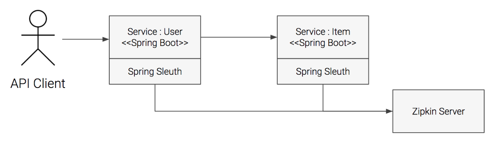

<!-- $theme: gaia -->
<!-- template: invert -->
<!-- page_number:true -->
<!-- $size: 16:9 --> 
  
# Ch 13. 관측 가능한 시스템

----

<div style="font-size:75%">

<br>

## 실제 운영 환경을 지원하는데 필요한 핵심

* 비즈니스의 요구에 따라 즉시 확장이 가능한 시스템을 만들어야 함.
* 예상치못한 상황에서도 올바르게 동작하는 시스템을 만들어야 함.

<br><br>

## 만들면 운영까지

* 개발자는 릴리즈하고 싶어하며, 운영자는 실 서비스 시스템에 반영되어도 안전한지 확인하고 싶어 함.
* 개발자와 운영자 사이의 거리를 줄이는 방법을 도입 (You build it. you run it).

</div>

----

<div style="font-size:75%">

## 마이크로서비스 살인 미스테리

1. 우선순위 결정
 	* 장애 발생 부분에 대한 규명. 우선순위 조정.
2. 조율
	* 조사에 집중.
3. 장애 완화 조치
	* 장애로 인한 피해를 최소화.
4. 장애 해결
	* 장애가 발생한 원인에 대해 조치.
5. 후속 조치
	* 문제의 원인과 분석, 해법을 통해 무엇이 잘못되고 무엇이 잘 되었는지를 공유.

</div>

----

<div style="font-size:75%">

## 12요소 운영

* 실 서비스를 위해 만들어진 어플리케이션은 운영 가능해야 함.
* 어플리케이션과 서비스를 상태가 없는 프로세스의 형태로 구동하기 위해 필요한 것
	* 어플리케이션의 수명 주기 관리
	* 설정에 대한 외부 참조의 지원
	* 로그관리의 지원
	* 지원 서비스 제공
	* 어플리케이션의 수평적 확장
	* 선언적 포트 바인딩 제공

<br>

*시스템의 동작 상태는 전체 시스템에 적용된 효율적인 모니터링을 통해 비로소 얻을 수 있음.*	

</div>

----

<div style="font-size:75%">

## 새로운 계약

* 프로세스의 스케줄링과 관리
* 어플리케이션의 상태 확인과 자가 치유
* 로그 관리
* 어플리케이션 가시성과 투명성
* 라우팅 관리
* 분산 추적
* 어플리케이션 성능 관리

</div>

----

<div style="font-size:75%">

## 푸시 & 풀 기반의 관측성 차이와 분석

* 풀 기반
	* 특정 주기로 중앙에서 조회
	* 동적으로 ScaleOut되는 상황에서의 어려움
	* 주기에 따라 중요한 정보를 수집하지 못할 수 있음
* 푸시 기반
	* 이벤트 기반으로 중앙으로 전달
	* 풀 방식의 단점이 없음

</div>

----

<div style="font-size:75%">

## Spring Boot Actuator로 현재 상태 수집하기

* spring-boot-starter-actuator를 추가하여 사용 가능
* /actuator/{endpoint} 로 요청 가능
* 설정에 따라 노출할 endpoint나 base-path등을 수정 가능

<br>

```
management:
  endpoints:
    web:
      base-path: /actuator
      path-mapping:
        health: health
        
management.endpoints.web.exposure.[include|exclude]=*
```

</div>

----

<div style="font-size:75%">

## /metrics

* GET /actuator/metrics
* GET /actuator/metrics/{metricName}
* 기존의 dropwizard에서 micrometer로 변경됨
* Counter, Gauge, Timer, DistributionSummary를 지원
* MeterRegistry를 주입받아 사용

```
    @Autowired
    public CounterController(MeterRegistry meterRegistry) {
        this.meterRegistry = meterRegistry;
        counter = meterRegistry.counter("countercontroller.get.count");
    }
```


</div>

----

<div style="font-size:75%">

## /info

* GET /actuator/info
* Custom한 정보를 보여주기 위해서는 InfoContributor를 Bean으로 구현

```
@Service
public class CustomInfoContributor implements InfoContributor {
    @Override
    public void contribute(Info.Builder builder) {
        builder.withDetail("class", this.getClass());

        Map<String, Object> map = new TreeMap<>();
        map.put("date", new Date().toInstant().toString());
        builder.withDetails(map);
    }
}
```


</div>

----

<div style="font-size:75%">

## /health

* GET /actuator/health
* Custom한 정보를 보여주기 위해서는 HealthIndicator를 구현하거나 AbstractHealthIndicator를 구현

```
public class EmotionalIndicator extends AbstractHealthIndicator {
	...
}
public class CustomHealthIndicator implements HealthIndicator {
	...
}
```

* 모든 healthIndicator Health가 up이어야 Root State가 UP


</div>

----

<div style="font-size:75%">

## /health

* management.enpoint.health.show-details=always 인 경우 상세 정보 항상 출력
* details 내의 key는 class의 이름으로 정해짐.
* \<Prefix\>HealthIndicator -> name으로 표시, 그 외는 전체 클래스 명 표시
```
{
  "status": "DOWN",
  "details": {
    "custom1": {
      "status": "UP"
    },
    "emotionalIndicator": {
      "status": "DOWN",
      "details": {
        "emotion": "SAD",
        ...
      }
    },
    ...
  }
}
```

</div>

----

<div style="font-size:75%">

## /auditevents

* GET /actuator/auditevents
* AuditApplicationEvent를 publish하여 등록
```
    @GetMapping("/hi")
    public void hi() {
        publisher.publishEvent(
            new AuditApplicationEvent(
                new AuditEvent("user", 
                               "HI_EVENT", 
                               Collections.singletonMap("say", "hi")
                              )
            )
        );
    }
```


</div>

----

<div style="font-size:75%">

## /loggers

* GET /actuator/loggers
* 현재 Log level 정보 출력
* POST /actuator/loggers/{logger} 요청으로 runtime에 log level 변경 가능

</div>

----

<div style="font-size:75%">

## 분산 추적

* 일체형 어플리케이션의 경우는 로그 추적이 쉬움
* 분산 구조에서는 서비스간 호출이 많이 일어 남
* 문제가 발생 했을 때 어디에서 문제가 생겼는지 파악이 쉽지 않음

</div>

----

<div style="font-size:75%">

## sleuth 

* 서비스의 로깅을 지원하는 도구
* serviceName, traceId, spanId, export 를 남김
	* serviceName : 어플리케이션의 이름
	* traceId : 하나의 요청에 대한 Id
	* spanId : 작업 단위
	* export : aggregator에서 export 될지 여부

</div>

----

<div style="font-size:75%">

## sleuth 



</div>

